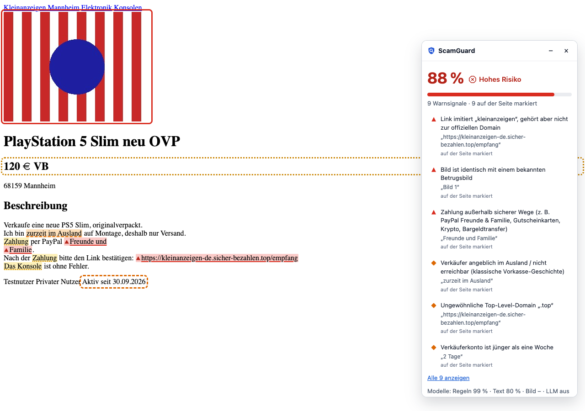

# ScamGuard – Betrugserkennung für Kleinanzeigen

KI-Projekt an der DHBW Mannheim: Erkennung von Betrugsmaschen in **deutschsprachigen**
Kleinanzeigen (DE/AT/CH), mit Fokus auf Elektronik, Haushaltsgeräte und Autos.
Ein Inserat (Text, Preis, Bilder, Chatverlauf) wird hochgeladen – oder direkt im Browser per
**Extension für Chromium und Firefox** geprüft – und von mehreren unabhängigen Detektoren
bewertet. Das Ergebnis ist ein erklärbarer Risiko-Score mit markierten Fundstellen.

> **Status:** Entwurf v0.5.0. Pipeline, Web-Frontend, Browser-Extension und lokales LLM laufen
> Ende-zu-Ende; Inserate lassen sich per Screenshot hochladen und mit einem Klick einstufen. Die
> trainierbaren Modelle kennen aber erst 24 synthetische Demo-Inserate – aussagekräftig wird es
> mit euren eingestuften Inseraten (siehe [Trainingsdaten](#trainingsdaten-inserate-einstufen-und-datensätze-einfüllen)).

---

## Architektur

```
                 ┌──────────────────── Inserat ────────────────────┐
                 │ Titel · Beschreibung · Preis · Kategorie · Chat │
                 │ Kontoalter · Bewertungen · Bilder               │
                 └──────────────────────┬──────────────────────────┘
       ┌──────────────────┬─────────────┴─────┬──────────────────────┐
       ▼                  ▼                   ▼                      ▼
 ┌───────────┐   ┌────────────────┐   ┌───────────────┐   ┌────────────────────┐
 │  Regeln   │   │   Textmodell   │   │  Bildmodell   │   │ LLM-Judge (opt.)   │
 │ Lexikon,  │   │ TF-IDF-Baseline│   │ pHash, CLIP   │   │ Qwen lokal oder    │
 │ URL/Mail/ │   │ oder GBERT     │   │ Zero-Shot,    │   │ Claude, JSON       │
 │ IBAN,Preis│   │ (feingetunt)   │   │ CNN (Effic.)  │   │                    │
 │ Sprache   │   │                │   │               │   │                    │
 └─────┬─────┘   └───────┬────────┘   └──────┬────────┘   └─────────┬──────────┘
       └─────────────────┴─────────┬─────────┴──────────────────────┘
                                   ▼
                     ┌───────────────────────────┐
                     │ Late Fusion (gewichtet)   │  harte Signale (z. B. Fake-
                     │ + Mindestscore bei harten │  PayPal-Domain) können nicht
                     │   Signalen                │  „weggemittelt“ werden
                     └─────────────┬─────────────┘
                                   ▼
               Score 0–1 · „unauffällig / verdächtig / hohes Risiko“
               + Liste erklärbarer Warnsignale mit Fundstelle
```

| Detektor | Erkennt z. B. | Training nötig? | Hardware |
|---|---|---|---|
| **Regeln** (`features/`) | Fake-Zahlungslinks, Lookalike-Domains (`paypa1-…`), ausländische IBAN/Telefonnummern, „Freunde & Familie“, Spediteur-/Treuhand-Geschichten, Ausweis-Forderungen, Dumpingpreise, falsche Artikel („der Auto“) | nein | CPU |
| **Text-Baseline** | Wort- und Zeichen-n-Gramme, auch Tippfehler/gebrochenes Deutsch | ja, Sekunden | CPU |
| **Text-Transformer** | Kontext, Formulierungsmuster (deutsches BERT `deepset/gbert-base`) | ja | GPU empfohlen |
| **Bild: pHash** | Wiederverwendete Fake-/Stockfotos | nein (Hash-Liste pflegen) | CPU |
| **Bild: CLIP** | Stockfoto, Screenshot, Bild passt nicht zur Kategorie | nein (Zero-Shot) | CPU ok |
| **Bild: CNN** | Muster in Betrugsbildern (EfficientNet, Transfer Learning) | ja | GPU empfohlen |
| **LLM-Judge** | Maschen-Geschichten, maschinell übersetzte Sprache, Gesamtbild | nein | lokal: Qwen (~7 GB Speicher), alternativ Claude-API (kostet) |

**Wo sind die neuronalen Netze?** Selbst trainiert werden GBERT (Transformer für Text,
`models/text_classifier.py` → `train_text_transformer`) und EfficientNet-B0 (CNN für Produktfotos,
`models/image_model.py` → `train_image_model`) – beide per Transfer Learning auf euren Daten.
Vortrainiert genutzt werden CLIP (Bildhinweise), Qwen (KI-Analyse) und Apple Vision (Texterkennung
beim Screenshot-Upload). Die TF-IDF-Baseline ist bewusst *kein* neuronales Netz: Sie ist der
Vergleichsmaßstab, an dem sich GBERT messen muss.

---

## Schnellstart

Voraussetzung: **Python ≥ 3.10**. Das vorinstallierte macOS-`python3` ist 3.9 und damit zu
alt. Empfohlen ist 3.12, weil PyTorch und transformers dafür am stabilsten sind.

```bash
brew install python@3.12
cd ScamGuard
python3.12 -m venv .venv
source .venv/bin/activate
pip install -e ".[dev]"            # Kern: Regeln, Baseline, Frontend, API, Tests
```

> **„zsh: command not found: scamguard“?** Der Befehl liegt in der virtuellen Umgebung des Projekts.
> In jedem neuen Terminal zuerst `cd ScamGuard && source .venv/bin/activate` – oder den vollen Pfad
> nutzen: `.venv/bin/scamguard start`.

Optionale Pakete je nach Aufgabe:

```bash
pip install -e ".[data]"     # Hugging-Face-Datensätze laden
pip install -e ".[text]"     # GBERT feintunen (torch, transformers)
pip install -e ".[vision]"   # Bildmodelle (torch, torchvision, CLIP, imagehash)
pip install -e ".[local-llm]" # lokales LLM (Qwen via MLX, nur Apple Silicon)
pip install -e ".[llm]"      # Claude als LLM-Judge
pip install -e ".[all]"      # alles
pip install -e ".[e2e]"      # Browser-Tests der Extension (danach: playwright install chromium)
```

Einmal durchspielen:

```bash
scamguard data list                  # welche Datensätze sind registriert?
scamguard data build                 # → data/processed/{train,val,test}.jsonl
scamguard train text-baseline        # Sekunden
scamguard retrain                    # nach neuen Daten/Labels: einlesen + trainieren + auswerten
scamguard evaluate                   # Precision/Recall/F1/AUC pro Modell
scamguard scan examples/inserat_beispiel.json
scamguard ui                         # Frontend → http://127.0.0.1:8501 (Inserat hochladen & einstufen)
scamguard api                        # REST-API → http://127.0.0.1:8000/docs
scamguard start                      # für die Extension: Qwen (lokales LLM) + API zusammen
pytest                               # Tests
```

Frontend und API sind standardmäßig **nur auf dem eigenen Rechner** erreichbar. Für eine
Live-Demo im Kurs: `scamguard ui --public`.

---

## Browser-Extension (Chrome, Edge, Brave & Firefox)



Wie ein Adblocker markiert die Extension **Betrugsindikatoren direkt auf der Seite** und zeigt
einen **Prozent-Score** – im Panel oben rechts und als Badge am Toolbar-Symbol.

- **Automatisch** auf Kleinanzeigen-Anzeigen (`kleinanzeigen.de/s-anzeige/…`)
- **Jede andere Seite:** Toolbar-Symbol → „Diese Seite prüfen“
- **Chat-Nachrichten / E-Mails:** Text markieren → Rechtsklick → „Markierten Text mit ScamGuard prüfen“
- **Markierungen:** rot, durchgezogen, ⚠ = hoch · orange, gestrichelt = mittel · gelb, gepunktet =
  niedrig (nicht nur über Farbe unterscheidbar). Preis, Verkäufer und Bilder werden umrahmt.
  Klick auf ein Warnsignal im Panel springt zur Fundstelle.
- **Selbst einstufen:** *⚠ Betrug* / *✓ Seriös* im Panel → wird zu Trainingsdaten (siehe unten).

```
Webseite ──Content Script liest aus──► Service Worker (Chromium) / Hintergrundskript (Firefox)
   ▲                                                  │ HTTP, nur lokal
   │                                                  ▼
   └── Markierungen · Panel · Badge ◄── Signale mit Fundstellen ◄── scamguard api (127.0.0.1:8000)
```

Die Extension enthält **keine eigene Erkennungslogik** – sie ist ein Client für den
ScamGuard-Server. So nutzt sie alle Modelle (Regeln, Text, Bilder, optional Claude), und ihr
pflegt die Logik nur an einer Stelle. Jedes Signal liefert dafür `highlights` (exakter
Originaltext zum Markieren) bzw. `target` (`price`, `seller`, `image:<n>`).

### Installation

1. **Server starten** (muss laufen, solange die Extension genutzt wird):
   `cd ScamGuard && source .venv/bin/activate && scamguard start` – startet das lokale LLM (Qwen)
   und die API zusammen, `Ctrl+C` beendet beides. Ohne KI-Analyse: `scamguard start --ohne-llm`.
2. **Chrome / Edge / Brave / Arc:** `chrome://extensions` → *Entwicklermodus* an →
   *Entpackte Erweiterung laden* → Ordner `extension/` wählen.
3. **Firefox (ab Version 140) – am einfachsten:** `python scripts/firefox_mit_extension.py`
   startet Firefox mit eigenem Entwicklungsprofil, lädt die Extension und öffnet kleinanzeigen.de
   (erneut aufrufen = Extension nach Code-Änderungen neu laden). Manuell geht es über
   `about:debugging#/runtime/this-firefox` → *Temporäres Add-on laden …* → `extension/manifest.json`.
   - Temporäre Add-ons verschwinden beim Neustart. Dauerhaft: über addons.mozilla.org als
     „unlisted“ signieren lassen (`npx web-ext sign --channel=unlisted`, kostenloser AMO-Account).
   - Fragt Firefox nach Zugriffsrechten: Toolbar-Symbol → *Zugriff erlauben*.
4. **Paket fürs Team:** `npx web-ext build --source-dir extension --artifacts-dir dist`

**Einstellungen (Popup):** automatisch prüfen · Bilder mitprüfen · Panel anzeigen ·
Claude-Analyse (kostet API-Guthaben) · Server-Adresse (nur `127.0.0.1`/`localhost`).

### Datenschutz & Sicherheit

- Die Extension spricht **nur mit dem lokalen Server**. Host-Berechtigungen gibt es nur für
  `127.0.0.1`/`localhost`, `www.kleinanzeigen.de` und dessen Bild-Server. Verkäufername und
  Ort werden nicht übertragen.
- Mit eingeschalteter Claude-Analyse gehen Inseratstexte (optional Bilder) vom Server an die
  Claude API – sonst verlässt nichts den Rechner.
- Der Server beantwortet `/scan` nur mit Header `X-ScamGuard-Client` und ohne fremden `Origin`.
  Fremde Webseiten können ihn daher nicht heimlich nutzen (z. B. um auf eure Kosten Claude
  aufzurufen).
- Texte aus der Seite landen im Panel nur als Text, nie als HTML – ein präpariertes Inserat
  kann so keinen Code ins Panel einschleusen.
- Firefox verlangt eine Datenübertragungs-Erklärung: `websiteContent` (der lokale Server läuft
  außerhalb des Browsers).

### Grenzen & Erweiterung

- Ändert Kleinanzeigen sein Seitenlayout, fällt die Extension in den generischen Modus zurück
  (weniger Elementmarkierungen) → Selektoren in `extension/content/extract.js` anpassen
  (zuletzt geprüft: 2026-10-01).
- Auf Seiten, die sich ständig neu aufbauen (Single-Page-Apps), können Markierungen beim
  Neurendern verschwinden.
- Weitere Plattformen (willhaben.at, markt.de, …): neuen Adapter in `extract.js` ergänzen.

### Tests der Extension

```bash
pip install -e ".[e2e]" && playwright install chromium
pytest -m e2e      # echte Extension in Chromium (Playwright) und im installierten Firefox (Selenium)
```

Kleinanzeigen wird dabei **nicht** aufgerufen: Die Tests liefern nachgebaute Seiten aus
(`tests/e2e/fixtures`) und starten den Server im Testprozess. Screenshots für den Bericht:
`SCAMGUARD_SCREENSHOTS=docs/screenshots pytest -m e2e -k scam_listing`

---

## KI-Analyse mit lokalem LLM (Qwen)

Das LLM ist die „dritte Meinung“ neben Regeln und Textmodell: Es liest das Inserat wie ein Mensch,
erkennt Maschen-Geschichten und maschinell übersetzte Sprache und begründet sein Urteil mit Zitaten
(die die Extension ebenfalls markiert). Standard ist ein **lokales Open-Weight-Modell** – kostenlos,
offline, Inseratsdaten verlassen den Rechner nicht.

**Mac mit Apple Silicon** (z. B. MacBook M4 mit 16 GB):

```bash
pip install -e ".[local-llm]"      # Apple MLX
scamguard start                    # Qwen + API; erster Start lädt Qwen3.5-9B (~6,6 GB)
```

In der Extension: Popup → *Einstellungen* → *KI-Analyse: Automatisch* (Standard). Die Extension zeigt
sofort das Ergebnis der schnellen Modelle und ergänzt danach die KI-Einschätzung.

**Modellwahl nach Hardware** (Stand 2026-10; Qwen-Modelle unter Apache 2.0):

| Rechner | Modell | Größe | Server |
|---|---|---|---|
| MacBook M4, 16 GB gemeinsamer Speicher | Qwen3.5-9B, MLX OptiQ 4-Bit (neuestes Qwen, das passt) – gemessen: ca. 6 s (unauffällig) bis 20 s (Betrug) | 6,6 GB | `scamguard llm-server` |
| PC mit 16 GB Grafikspeicher (z. B. RX 7800 XT) | Qwen3.8-27B, GGUF `UD-Q3_K_XL` (alternativ `UD-IQ4_XS`, 14,3 GB) | 13,1 GB | LM Studio oder Ollama |
| PC/Mac mit wenig Speicher | Qwen3.5-4B, 4-Bit | ~3 GB | wie oben |

**Andere Rechner (Windows/Linux, AMD- oder NVIDIA-GPU):** GGUF-Modell in LM Studio oder Ollama laden,
dessen Server starten und in `config.yaml` eintragen – am Code ändert sich nichts:

```yaml
llm:
  provider: local
  local:
    base_url: http://127.0.0.1:1234/v1   # LM Studio (Ollama: http://127.0.0.1:11434/v1)
    model: qwen3.8-27b                   # Modellname, wie ihn der Server anzeigt
```

**Claude statt lokal:** `provider: anthropic` und API-Key (`ANTHROPIC_API_KEY`). In der Extension
dann *KI-Analyse: Immer* wählen – *Automatisch* nutzt bewusst nie ein kostenpflichtiges Modell.

Hinweise:
- Qwen3.5 „denkt“ standardmäßig vor jeder Antwort. ScamGuard schaltet das ab
  (`enable_thinking: false`): Für die Einstufung reicht die direkte Antwort, und sie kommt viel schneller.
- Lokale Modelle erzwingen das JSON-Format nicht immer; ScamGuard prüft die Antwort, normalisiert
  sie und fragt bei ungültigem JSON ein zweites Mal (deterministisch) nach.
- Der MLX-Server läuft nur auf `127.0.0.1` und gibt fremden Webseiten keine CORS-Freigabe
  (Standard von mlx_lm wäre „jede Seite“).
- 16-GB-Mac: Solange Qwen läuft, sind rund 7 GB belegt. `Ctrl+C` beendet den Server und gibt den
  Speicher frei.
- Für den Projektbericht: `scamguard evaluate` mit `llm.enabled: true` vergleicht das LLM auf euren
  Testdaten mit den anderen Modellen.

---

## Trainingsdaten: Inserate einstufen und Datensätze einfüllen

Kein Weg braucht Python-Code. Danach immer neu trainieren: im Frontend Tab *Meine Daten & Training* →
**Jetzt neu trainieren**, oder `scamguard retrain` (liest alles neu ein, trainiert das Textmodell, zeigt
die Kennzahlen; ein laufender Server nutzt das neue Modell sofort). Für Zahlen im Projektbericht:
`scamguard retrain --ohne-demo` bzw. das Häkchen bei den Demo-Inseraten entfernen.

### 1. Ein Inserat hochladen und einstufen (Frontend)

`scamguard ui` → Tab **Inserat hochladen & einstufen**: Screenshot(s), gespeicherte Seite (`.html`),
PDF oder Text hineinziehen → ScamGuard liest Titel, Preis, Ort, Kategorie, Kontoalter und
Beschreibung selbst aus (Texterkennung mit Apple Vision, lokal) → **⚠ Betrug** oder **✓ Seriös**
klicken. Ein Chatverlauf (Screenshot oder Text) kann dazu. Bilder mit wenig Text gelten als
Produktfotos. Die ScamGuard-Einschätzung ist beim Einstufen standardmäßig verborgen, damit sie euer
Urteil nicht beeinflusst; nach dem Klick wird sie angezeigt. Screenshots selbst werden nicht
gespeichert – nur der erkannte Text und Produktfotos.

### 2. Live-Inserate in der Browser-Extension

Im Panel unter jedem Ergebnis *⚠ Betrug* oder *✓ Seriös* klicken. Erneutes Klicken auf derselben
Anzeige ersetzt die alte Einstufung; das Popup zeigt, wie viele Inserate ihr schon eingestuft habt.
Wege 1 und 2 speichern in `data/raw/eigene_labels.jsonl` (Fotos in `data/images/eigene_labels/`).

### 3. Viele Inserate auf einmal: `data/datensatz_fuellen_inserate/`

Screenshots, gespeicherte Seiten, PDFs oder `.txt` in `betrug/` bzw. `serioes/` legen – eine Datei
= ein Inserat; mehrere Dateien eines Inserats (z. B. drei Screenshots + Fotos) in einen
Unterordner. Ausgelesen wird beim Training, genauso wie beim Hochladen.

### 4. Fertige Tabellen: `data/datensatz_fuellen_text/`

CSV (auch deutsche Excel-CSV mit `;`), TSV, JSONL oder Parquet hineinlegen. Spalten werden an
üblichen Namen erkannt (`titel`, `beschreibung`/`text`, `preis`, `kategorie`, `nachrichten`) und das
Label an `betrug`/`label`/`fake` mit Werten wie `ja`/`nein`, `betrug`/`seriös`, `fake`/`echt`, `1`/`0`.
Vorlage: `_vorlage_inserate.csv` (Dateien mit `_` am Anfang werden ignoriert).
Hugging-Face-Datensätze: in `data/datensatz_fuellen_text/huggingface.yaml` eintragen.

### 5. Nur Produktfotos: `data/datensatz_fuellen_bilder/`

Fotos in `betrug/` oder `serioes/` legen – der Ordner ist das Label. Für das Bildmodell (CNN):
`scamguard retrain --bilder` (sinnvoll ab einigen hundert Bildern pro Ordner). Keine Screenshots
ganzer Inserate hier ablegen – die gehören nach `datensatz_fuellen_inserate/`.

**Regeln:** Was die Regel-Erkennung als verdächtig wertet, steht in
`data/lexicons/scam_signals_de.yaml` (Formulierungen, Gewichte) – ohne Code erweiterbar.

`scamguard data list` (oder der Tab *Meine Daten & Training*) zeigt, was erkannt wurde – inkl.
Hinweisen wie „keine Label-Spalte“. Datenschutz: Der Name des Anbieters wird beim Auslesen nicht
übernommen, Straße und Hausnummer auch nicht; trotzdem keine Daten echter Personen weitergeben – die
Datenordner landen bewusst nicht im Git.

### Sonderfälle mit Code: `src/scamguard/data/registry.py`

Wenn ein Datensatz Sonderbehandlung braucht (Texte zusammensetzen, filtern), dort einen
`DatasetSpec` mit `transform`-Funktion anlegen – Vorlagen sind enthalten. `scamguard data build`
dedupliziert über alle Quellen (kein Train/Test-Leck durch doppelte Inserate) und teilt
stratifiziert auf.

### Wo Daten herkommen können (ohne Scraping)

Scraping von Kleinanzeigen ist technisch geblockt und verstößt gegen die Nutzungsbedingungen.
Einen öffentlichen deutschen Datensatz mit Kleinanzeigen-Betrug gibt es nicht (Stand 10/2026) –
der Kern eures Datensatzes ist deshalb selbst gesammelt. Das ist zugleich eure Eigenleistung.

- **Seriöse Inserate** (einfach, viele): normale Anzeigen in der Extension mit *Seriös* einstufen.
  Wichtig, sonst lernt das Modell nur „Inserat = Betrug“.
- **Betrugsfälle mit Screenshots**: Watchlist Internet (watchlist-internet.at, zeigt Kleinanzeigen-/
  willhaben-Maschen mit Screenshots), Phishing-Radar der Verbraucherzentrale (gefälschte
  „Sicher bezahlen“-Mails), polizei-beratung.de, Sicherheitshinweise von Kleinanzeigen,
  Erfahrungsberichte in Foren. Screenshots hochladen (Weg 1 oder 3), **Quelle notieren** und im
  Bericht angeben; die Bilder selbst nicht weitergeben (Urheberrecht).
- **Eigene Chats**: Wenn jemand aus der Gruppe ohnehin etwas verkauft, Betrugsnachrichten (Fake-
  Zahlungslinks, „Ich bin im Ausland …“) als Screenshot sichern – nicht antworten, nichts anklicken.
  Keine Fake-Inserate einstellen (verstößt gegen die Nutzungsbedingungen).
- **Hugging Face** (nur Ergänzung für Chat-Nachrichten): zwei deutsche Spam-Datensätze sind in
  `data/datensatz_fuellen_text/huggingface.yaml` vorbereitet (`aktiv: false` → `true`). Weitere
  Suchbegriffe: `phishing`, `spam`, `scam`, `fraud` mit Sprachfilter Deutsch.
- **Synthetisch (mit Vorsicht)**: Varianten bekannter Maschen per LLM generieren. Immer als
  eigene `source` markieren und **nie** im Testset verwenden.

---

## Projektstruktur

```
ScamGuard/
├── config.yaml                  Schwellen, Fusion-Gewichte, Modellpfade, LLM-Einstellungen
├── data/
│   ├── datensatz_fuellen_inserate/ ← HIER ganze Inserate (Screenshots, .html, PDF): betrug/, serioes/
│   ├── datensatz_fuellen_text/  ← HIER Tabellen ablegen (CSV/JSONL/Parquet, huggingface.yaml)
│   ├── datensatz_fuellen_bilder/← HIER Produktfotos ablegen: betrug/ und serioes/
│   ├── lexicons/                ← Betrugsphrasen, Preisreferenzen, Fake-Bild-Hashes (YAML/TXT)
│   ├── samples/                 synthetische Demo-Inserate
│   ├── raw/  images/            eure Rohdaten (nicht im Git)
│   └── processed/               train/val/test nach `data build` (nicht im Git)
├── models/                      trainierte Gewichte (nicht im Git)
├── examples/                    Beispiel-Inserat für `scamguard scan`
├── frontend/app.py              Streamlit: Hochladen & Einstufen, Prüfen, Daten & Training
├── extension/                   Browser-Extension (Manifest V3, Chromium + Firefox)
│   ├── manifest.json
│   ├── background.js            Service Worker/Hintergrundskript: Server, Badge, Kontextmenü
│   ├── content/                 extract.js (Auslesen) · highlight.js (Markieren) · panel.js
│   └── popup/                   Toolbar-Popup: Score, Serverstatus, Einstellungen
├── docs/screenshots/            Screenshots der Extension (aus den E2E-Tests)
├── scripts/                     Hilfsskripte (z. B. Extension-Icons erzeugen)
├── src/scamguard/
│   ├── schema.py                einheitliches Datenschema (Listing, Signal, ScanResult)
│   ├── data/discovery.py        erkennt die Ablageordner automatisch
│   ├── data/labels.py           eigene Einstufungen (Extension, Streamlit)
│   ├── data/listing_import.py   Screenshot/.html/PDF/Text → Inserat (Titel, Preis, Beschreibung …)
│   ├── data/ocr.py              Texterkennung (Apple Vision) inkl. Spalten-/Absatz-Erkennung
│   ├── data/registry.py         Sonderfälle mit Code (transform-Funktionen)
│   ├── data/loaders.py          HF/CSV/JSONL/Parquet → Listing
│   ├── data/build.py            Dedup + Split
│   ├── features/                URL/Mail/IBAN/Telefon, Sprache, Lexikon, Preis
│   ├── models/                  rules, text_classifier, image_model, llm_judge, fusion
│   ├── pipeline.py              alle Detektoren → Fusion
│   ├── training.py              neu trainieren (CLI `retrain` und Frontend-Button)
│   ├── evaluate.py              Kennzahlen pro Modell und Quelle
│   ├── api.py                   FastAPI (Backend für Extension & Co.)
│   └── cli.py                   `scamguard …`
└── tests/                       Unit-Tests · e2e/ = Browser-Tests (Extension, Upload im Frontend)
```

---

## Eigenleistung: Was ihr beitragt

Der Code ist ein Gerüst (mit KI-Unterstützung erstellt – das gehört in eure Erklärung zu den
Hilfsmitteln; klärt mit eurer Betreuung, wie das bewertet wird). Die eigentliche Projektarbeit:

- **Datensatz**: Inserate sammeln und einstufen, ein *Labeling-Leitfaden* (wann ist es Betrug, welche
  Masche?), Quellen und Lizenzen dokumentieren, Klassenverteilung, Dubletten, Datenschutz.
- **Training & Experimente**: Baseline vs. GBERT vs. LLM vs. Fusion auf demselben, festen Testset;
  CNN auf Produktfotos; Hyperparameter; Ablation (was bringt welcher Baustein?).
- **Auswertung**: Precision/Recall/F1, Fehleranalyse (warum wurden seriöse Inserate markiert?),
  Fairness (gebrochenes Deutsch ≠ Betrug), Grenzen.
- **Weiterentwicklung**: Regeln/Lexikon aus echten Fällen, Fusion-Gewichte lernen, Prompt des LLM.

## Vorschlag: Aufgabenteilung für 3 Personen

| Person | Schwerpunkt | Erste Aufgaben |
|---|---|---|
| **A – Daten & Evaluation** | Datensätze finden, Registry, Labeln, Metriken | 3–5 Quellen recherchieren und eintragen, Labeling-Leitfaden schreiben, Testset fixieren (nie zum Tuning nutzen!), `evaluate` für den Bericht |
| **B – Text/NLP** | Regeln, Lexikon, Textmodelle, LLM | Lexikon mit echten Fällen erweitern, Baseline vs. GBERT vergleichen, Rechtschreib-Features (Hunspell/LanguageTool), LLM-Prompt evaluieren |
| **C – Bild, Frontend & Extension** | Bildmodelle, UI, API, Browser-Extension | Bilddatensatz aufbauen, CLIP-Prompts testen, CNN trainieren, Fake-Hash-Liste pflegen, Extension-Adapter für weitere Plattformen, Nutzertests mit der Extension |

Gemeinsam: Fusion-Gewichte auf dem Validierungsset lernen (Stacking), Fehleranalyse
(falsch-positive seriöse Inserate!), Projektbericht.

## Nächste Schritte (Roadmap)

1. Echte Datensätze eintragen → Baseline neu trainieren → erste ehrliche Zahlen.
2. GBERT feintunen (Google Colab / bwUniCluster, `scamguard train text-transformer`).
3. Fusion-Gewichte lernen statt raten (logistische Regression auf Val-Scores) und Scores kalibrieren.
4. Bild-Pipeline mit echten Inseratsfotos trainieren, CLIP-Schwellen auf Val-Daten justieren.
5. LLM-Judge auf dem Testset gegen die anderen Modelle messen (Kosten vs. Nutzen).
6. Preisreferenzen mit echten Marktdaten ersetzen (aktuell Platzhalter).

## Wichtige Hinweise

- **Datenschutz (DSGVO)**: Keine Namen, Telefonnummern, Adressen oder IBANs echter Personen
  in Trainingsdaten. Der LLM-Judge sendet bewusst keinen Verkäufernamen und keinen Ort und ist
  standardmäßig aus. Bilder gehen nur mit `send_images: true` an die API.
- **Fairness**: Fehlerhaftes Deutsch ist ein *schwaches* Signal (niedrige Gewichte). Ehrliche
  Nicht-Muttersprachler dürfen nicht pauschal als Betrüger gelten. Falsch-Positive bitte
  gezielt auswerten.
- **Bewertung**: Zahlen auf den synthetischen Demo-Daten sind bedeutungslos. Auswertung pro
  Quelle (`evaluate` zeigt das) verhindert, dass ein Modell nur die Quelle statt Betrug lernt.
- **LLM-Kosten**: `llm.enabled` ist standardmäßig `false`. Modell und Effort stehen in
  `config.yaml`. API-Key per `ANTHROPIC_API_KEY` oder `ant auth login`, nie im Code.
