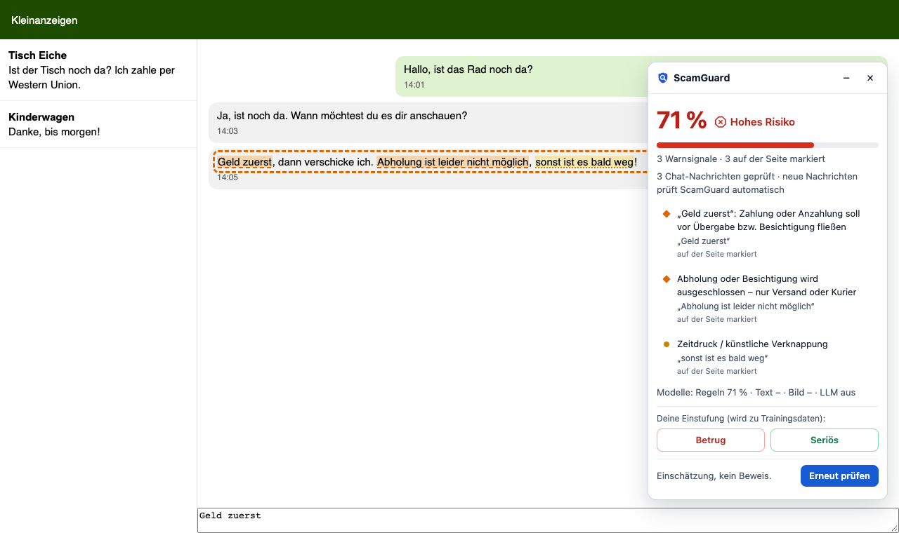

# ScamGuard

**Betrugserkennung für deutschsprachige Kleinanzeigen – im Browser, in Echtzeit, erklärbar.**

ScamGuard prüft Inserate und Chatverläufe auf Plattformen wie Kleinanzeigen (DE/AT/CH) auf bekannte
Betrugsmaschen: Fake-Zahlungslinks, Vorkasse-Geschichten, PayPal „Freunde & Familie“,
Dreiecksbetrug, Datenabfragen und mehr. Mehrere unabhängige Detektoren bewerten Text, Preis, Bilder
und Nachrichten; das Ergebnis ist ein Risiko-Score mit markierten Fundstellen direkt auf der Seite.

Entstanden als Projekt an der DHBW Mannheim. Aktueller Stand: **v0.8.0** ([Changelog](CHANGELOG.md)).

- **Browser-Extension** für Chromium und Firefox: markiert Warnsignale wie ein Adblocker, prüft auch das
  Postfach live, jede neue Nachricht ohne Neuladen.
- **Lokales LLM** (Qwen über MLX): KI-Analyse ohne Cloud – die Inseratsdaten bleiben auf dem Rechner.
- **Web-App** zum Prüfen per Screenshot, gespeicherter Seite oder Text, mit Annotation-Workspace
  fürs Team.
- **Datenpipeline** ohne Scraping: eigene Labels, Ablageordner, Hugging Face, öffentliche Warnungen,
  Foren-Erfahrungsberichte.

> Die trainierbaren Modelle sind bisher nur auf synthetischen Demo-Daten trainiert. Aussagekräftige
> Kennzahlen entstehen mit dem laufenden Labeling ([Daten & Labeling](#daten--labeling)).

---

## Architektur

```
                 ┌──────────────────── Inserat ────────────────────┐
                 │ Titel · Beschreibung · Preis · Kategorie · Chat │
                 │ Kontoalter · Bewertungen · Bilder               │
                 └──────────────────────┬──────────────────────────┘
       ┌──────────────────┬─────────────┴─────┬──────────────────────┐
       ▼                  ▼                   ▼                      ▼
 ┌───────────┐   ┌────────────────┐   ┌───────────────┐   ┌────────────────────┐
 │  Regeln   │   │   Textmodell   │   │  Bildmodell   │   │ LLM-Judge (opt.)   │
 │ Lexikon,  │   │ TF-IDF-Baseline│   │ pHash, CLIP   │   │ Qwen lokal oder    │
 │ URL/Mail/ │   │ oder GBERT     │   │ Zero-Shot,    │   │ Claude API, JSON   │
 │ IBAN,Preis│   │ (feingetunt)   │   │ CNN (Effic.)  │   │                    │
 │ Sprache   │   │                │   │               │   │                    │
 └─────┬─────┘   └───────┬────────┘   └──────┬────────┘   └─────────┬──────────┘
       └─────────────────┴─────────┬─────────┴──────────────────────┘
                                   ▼
                     ┌───────────────────────────┐
                     │ Late Fusion (gewichtet)   │  harte Signale (z. B. Fake-
                     │ + Mindestscore bei harten │  PayPal-Domain) können nicht
                     │   Signalen                │  „weggemittelt“ werden
                     └─────────────┬─────────────┘
                                   ▼
               Score 0–1 · „unauffällig / verdächtig / hohes Risiko“
               + Liste erklärbarer Warnsignale mit Fundstelle
```

| Detektor | Erkennt z. B. | Training | Hardware |
|---|---|---|---|
| **Regeln** (`features/`) | Fake-Zahlungslinks, Lookalike-Domains (`paypa1-…`), ausländische IBAN/Telefonnummern, „Freunde & Familie“, Spediteur-/Treuhand-Geschichten, Ausweis-Forderungen, Dumpingpreise, falsche Artikel („der Auto“); in Nachrichten/Mails/SMS: Konto-gesperrt-Phishing, Paket-/Zoll-SMS, Code-Weitergabe, „Zahlung reserviert“, Zeitdruck, „Geld zuerst“; Anbieter: junges Konto, keine Bewertungen, Firma als „Privater Nutzer“ | nein | CPU |
| **Text-Baseline** | Wort- und Zeichen-n-Gramme, auch Tippfehler/gebrochenes Deutsch | Sekunden | CPU |
| **Text-Transformer** | Kontext, Formulierungsmuster (`deepset/gbert-base`, feingetunt) | ja | GPU empfohlen |
| **Bild: pHash** | wiederverwendete Fake-/Stockfotos | nein (Hash-Liste) | CPU |
| **Bild: CLIP** | Stockfoto, Screenshot, Bild passt nicht zur Kategorie | nein (Zero-Shot) | CPU |
| **Bild: CNN** | Muster in Betrugsbildern (EfficientNet-B0, Transfer Learning) | ja | GPU empfohlen |
| **LLM-Judge** | Maschen-Geschichten, maschinell übersetzte Sprache, Gesamtbild | nein | lokal: Qwen (~7 GB), alternativ Claude API |

**Modelle im Überblick:** Selbst trainiert werden GBERT (`models/text_classifier.py` →
`train_text_transformer`) und EfficientNet-B0 (`models/image_model.py` → `train_image_model`), beide
per Transfer Learning. Vortrainiert im Einsatz: CLIP (Bildhinweise), Qwen (KI-Analyse) und Apple Vision
(Texterkennung beim Screenshot-Upload). Die TF-IDF-Baseline ist bewusst klassisches ML und dient als
Messlatte für die neuronalen Modelle.

---

## Quickstart

Voraussetzung: **Python ≥ 3.10**, empfohlen 3.12 (stabilste Basis für PyTorch und transformers). Das
vorinstallierte macOS-`python3` (3.9) ist zu alt.

```bash
brew install python@3.12
git clone https://github.com/derangler3008/ScamGuard.git && cd ScamGuard
python3.12 -m venv .venv && source .venv/bin/activate
pip install -e ".[dev]"            # Kern: Regeln, Baseline, Web-App, API, Tests
```

> **`command not found: scamguard`?** Die CLI liegt in der virtuellen Umgebung: in jedem neuen Terminal
> `source .venv/bin/activate` – oder direkt `.venv/bin/scamguard start`.

Optionale Extras:

```bash
pip install -e ".[data]"       # Hugging-Face-Datensätze
pip install -e ".[text]"       # GBERT feintunen (torch, transformers)
pip install -e ".[vision]"     # Bildmodelle (torch, torchvision, CLIP, imagehash)
pip install -e ".[local-llm]"  # lokales LLM (Qwen via MLX, nur Apple Silicon)
pip install -e ".[llm]"        # Claude API als LLM-Judge
pip install -e ".[all]"        # alles
pip install -e ".[e2e]"        # Browser-Tests der Extension (danach: playwright install chromium)
```

Erste Schritte:

```bash
scamguard data list                  # registrierte Datensätze
scamguard data build                 # → data/processed/{train,val,test}.jsonl
scamguard retrain                    # einlesen + trainieren + auswerten
scamguard evaluate                   # Precision/Recall/F1/AUC pro Modell und Quelle
scamguard scan examples/inserat_beispiel.json
scamguard ui                         # Web-App → http://127.0.0.1:8501
scamguard api                        # REST-API → http://127.0.0.1:8000/docs
scamguard start                      # für die Extension: Qwen + API zusammen
pytest                               # Tests
```

Web-App und API lauschen standardmäßig **nur lokal**. Für Demos im Netzwerk: `scamguard ui --public`.

---

## Browser-Extension (Chrome, Edge, Brave & Firefox)


Die Extension markiert **Betrugsindikatoren direkt auf der Seite** und zeigt einen **Prozent-Score** –
im Panel oben rechts und als Badge am Toolbar-Symbol.

- **Automatisch** auf Kleinanzeigen-Anzeigen (`kleinanzeigen.de/s-anzeige/…`).
- **Im Postfach** (`kleinanzeigen.de/m-nachrichten…`): prüft den Chatverlauf und jede neu eintreffende
  Nachricht ohne Neuladen. Auffällige Nachrichten werden eingerahmt, Fundstellen markiert („Geld zuerst“,
  „sonst ist es bald weg“, „schick mir deine Handynummer für die Zahlung“ …).
- **Jede andere Seite:** Toolbar-Symbol → „Diese Seite prüfen“.
- **WhatsApp, E-Mail, andere Chats:** Text markieren → Rechtsklick → „Markierten Text mit ScamGuard prüfen“.
- **Markierungen:** rot, durchgezogen, Dreieck = hoch · orange, gestrichelt = mittel · gelb, gepunktet =
  niedrig (nicht nur über Farbe unterscheidbar). Preis, Verkäufer, Bilder und Nachrichten werden
  umrahmt; ein Klick auf ein Warnsignal springt zur Fundstelle.
- **Anbieter im Blick:** Das Panel zeigt Kontoalter, Bewertungs-Abzeichen („TOP Zufriedenheit“,
  „Besonders zuverlässig“), Zahl der Anzeigen und ob privat oder gewerblich. Händler, Firmen (Rechtsform
  wie GmbH, UG, GbR im Namen) und Dienstleistungen/Werbung ohne Festpreis werden als solche markiert –
  ihre geschäftliche Telefonnummer, Adresse oder Website zählt dann kaum als Warnsignal.
- **Labeln:** *Betrug* / *Seriös* im Panel speichert das Inserat bzw. den Chatverlauf als Trainingsdaten –
  mit Fotos, Kategorie und Anbieterprofil, zusätzlich als Ordner im Datensatz (siehe
  [Ablage beim Labeln](#ablage-beim-labeln)).



```
Webseite ──Content Script liest aus──► Service Worker (Chromium) / Hintergrundskript (Firefox)
   ▲                                                  │ HTTP, nur lokal
   │                                                  ▼
   └── Markierungen · Panel · Badge ◄── Signale mit Fundstellen ◄── scamguard api (127.0.0.1:8000)
```

Die Extension enthält **keine eigene Erkennungslogik**, sie ist ein Client des ScamGuard-Servers. So
nutzt sie alle Modelle, und die Logik wird an genau einer Stelle gepflegt. Jedes Signal liefert dafür
`highlights` (exakter Originaltext) bzw. `target` (`price`, `seller`, `image:<n>`).

### Installation

1. **Server starten** (muss laufen, solange die Extension genutzt wird):
   `scamguard start` – startet Qwen und die API zusammen, `Ctrl+C` beendet beides.
   Ohne KI-Analyse: `scamguard start --ohne-llm`.
2. **Chrome / Edge / Brave / Arc:** `chrome://extensions` → *Entwicklermodus* →
   *Entpackte Erweiterung laden* → Ordner `extension/`.
3. **Firefox (ab 140):** `python scripts/firefox_mit_extension.py` startet Firefox mit eigenem
   Entwicklungsprofil und geladener Extension (erneut aufrufen = nach Code-Änderungen neu laden).
   Manuell: `about:debugging#/runtime/this-firefox` → *Temporäres Add-on laden …* → `extension/manifest.json`.
   - Temporäre Add-ons verschwinden beim Neustart. Dauerhaft: als „unlisted“ signieren
     (`npx web-ext sign --channel=unlisted`, kostenloser AMO-Account).
   - Fragt Firefox nach Zugriffsrechten: Toolbar-Symbol → *Zugriff erlauben*.
4. **Paket bauen:** `npx web-ext build --source-dir extension --artifacts-dir dist`

**Einstellungen (Popup):** automatisch prüfen · Bilder mitprüfen · Panel anzeigen · KI-Analyse
(automatisch/immer/nie) · Server-Adresse (nur `127.0.0.1`/`localhost`).

### Datenschutz & Sicherheit

- Die Extension spricht **nur mit dem lokalen Server**. Host-Berechtigungen gibt es nur für
  `127.0.0.1`/`localhost`, `www.kleinanzeigen.de` und dessen Bild-Server. Verkäufername und Ort werden
  nicht übertragen; aus dem Namen wird nur eine Rechtsform (GmbH, UG …) abgeleitet.
- Nur mit eingeschalteter Claude-Analyse gehen Inseratstexte (optional Bilder) an die Claude API – sonst
  verlässt nichts den Rechner.
- Der Server beantwortet `/scan` nur mit Header `X-ScamGuard-Client` und ohne fremden `Origin`. Fremde
  Webseiten können ihn daher nicht heimlich nutzen (etwa um kostenpflichtige API-Aufrufe auszulösen).
- Seiteninhalte landen im Panel nur als Text, nie als HTML – ein präpariertes Inserat kann keinen Code
  einschleusen.
- Firefox-Datenübertragungs-Erklärung: `websiteContent` (der lokale Server läuft außerhalb des Browsers).

### Bekannte Grenzen

- Ändert Kleinanzeigen das Seitenlayout, fällt die Extension in den generischen Modus zurück (weniger
  Elementmarkierungen) → Selektoren in `extension/content/extract.js` anpassen. Seit 10/2026 laufen zwei
  Layouts parallel; gelesen wird über IDs und die schema.org-Auszeichnung, die beide gemeinsam haben
  (zuletzt geprüft: 2026-10-06).
- **Postfach:** nur eingeloggt sichtbar, ohne stabile IDs. Der Verlauf wird ohne feste Selektoren gefunden
  (ARIA-Log bzw. innerster Scrollbereich) – getestet an einem Nachbau. Eigene und fremde Nachrichten
  werden nicht unterschieden. Fallback: Chat markieren → Rechtsklick → prüfen.
- **Reine Chats im Textmodell:** Ohne gelernte Chats rät ein Textmodell dort nur (das Demo-Modell hielt
  „Hallo, ist das noch da?“ für 72 % Betrug). Es urteilt deshalb erst ab 20 Chat-Beispielen pro Klasse;
  bis dahin entscheiden Regeln und LLM.
- Single-Page-Apps können Markierungen beim Neurendern entfernen.
- Weitere Plattformen (willhaben.at, markt.de, …): neuen Adapter in `extract.js` ergänzen.

### Tests der Extension

```bash
pip install -e ".[e2e]" && playwright install chromium
pytest -m e2e      # echte Extension in Chromium (Playwright) und im installierten Firefox (Selenium)
```

Kleinanzeigen wird dabei **nicht** aufgerufen: Die Tests liefern nachgebaute Seiten aus
(`tests/e2e/fixtures`) und starten den Server im Testprozess. Screenshots aktualisieren:
`SCAMGUARD_SCREENSHOTS=docs/screenshots pytest -m e2e -k "scam_listing or chat"`

---

## LLM: lokal mit Qwen

Das LLM ist die dritte Meinung neben Regeln und Textmodell: Es liest das Inserat im Zusammenhang,
erkennt Maschen-Geschichten und maschinell übersetzte Sprache und begründet sein Urteil mit Zitaten,
die die Extension ebenfalls markiert. Standard ist ein **lokales Open-Weight-Modell** – kostenlos,
offline, ohne Datenabfluss.

**Mac mit Apple Silicon** (z. B. MacBook M4, 16 GB):

```bash
pip install -e ".[local-llm]"      # Apple MLX
scamguard start                    # Qwen + API; erster Start lädt Qwen3.5-9B (~6,6 GB)
```

In der Extension: Popup → *Einstellungen* → *KI-Analyse: Automatisch* (Standard). Das Ergebnis der
schnellen Modelle erscheint sofort, die KI-Einschätzung wird nachgereicht.

**Modellwahl nach Hardware** (Stand 2026-10; Qwen-Modelle unter Apache 2.0):

| Rechner | Modell | Größe | Server |
|---|---|---|---|
| MacBook M4, 16 GB | Qwen3.5-9B, MLX OptiQ 4-Bit – gemessen: ca. 6 s (unauffällig) bis 20 s (Betrug) | 6,6 GB | `scamguard llm-server` |
| PC mit 16 GB VRAM (z. B. RX 7800 XT) | Qwen3.8-27B, GGUF `UD-Q3_K_XL` (alternativ `UD-IQ4_XS`, 14,3 GB) | 13,1 GB | LM Studio oder Ollama |
| wenig Speicher | Qwen3.5-4B, 4-Bit | ~3 GB | wie oben |

**Windows/Linux (AMD/NVIDIA):** GGUF-Modell in LM Studio oder Ollama laden, Server starten und in
`config.yaml` eintragen – ohne Code-Änderung:

```yaml
llm:
  provider: local
  local:
    base_url: http://127.0.0.1:1234/v1   # LM Studio (Ollama: http://127.0.0.1:11434/v1)
    model: qwen3.8-27b                   # Modellname, wie ihn der Server anzeigt
```

**Cloud statt lokal:** `provider: anthropic` und `ANTHROPIC_API_KEY`. In der Extension dann
*KI-Analyse: Immer* – *Automatisch* nutzt bewusst nie ein kostenpflichtiges Modell.

Details:
- Qwen3.5 „denkt“ standardmäßig vor jeder Antwort; ScamGuard schaltet das ab (`enable_thinking: false`) –
  für die Klassifikation reicht die direkte Antwort, und sie ist deutlich schneller.
- Lokale Server erzwingen das JSON-Format nicht immer; die Antwort wird validiert, normalisiert und bei
  ungültigem JSON einmal deterministisch neu angefragt.
- Der MLX-Server läuft nur auf `127.0.0.1` ohne CORS-Freigabe für fremde Seiten.
- 16-GB-Mac: Solange Qwen läuft, sind rund 7 GB belegt; `Ctrl+C` gibt den Speicher frei.
- Vergleich mit den anderen Modellen: `scamguard evaluate --llm --max 100`.

### Qwen feintunen (LoRA)

Mit genug eigenen Labels lässt sich Qwen per LoRA anpassen – lokal mit MLX, ohne Cloud:

```bash
scamguard data build && scamguard llm-daten     # → data/finetune/{train,valid,test}.jsonl
# Qwen-Server vorher beenden (16 GB reichen nicht für beides)
mlx_lm.lora --model mlx-community/Qwen3.5-9B-OptiQ-4bit --train --data data/finetune \
  --adapter-path models/qwen_lora --mask-prompt --batch-size 1 --num-layers 8 --iters 600 \
  --learning-rate 1e-5 --grad-checkpoint --max-seq-length 2048
scamguard llm-server --adapter models/qwen_lora  # oder dauerhaft: llm.local.adapter_path in config.yaml
```

Die Trainingsbeispiele nutzen exakt den Prompt des Betriebs. Die Zielantwort entsteht aus den Labels,
den im Team markierten Sätzen und – wo keine vorliegen – den Regel-Treffern. Ablauf, Speicherbedarf,
Datenmengen und Alternativen: **[docs/llm_feintuning.md](docs/llm_feintuning.md)**.

---

## Daten & Labeling

Kein Weg braucht Python-Code. Nach neuen Daten neu trainieren: Web-App, Tab *Meine Daten & Training* →
**Jetzt neu trainieren**, oder `scamguard retrain` (ein laufender Server nutzt das neue Modell sofort).
Für belastbare Kennzahlen ohne die Demo-Daten: `scamguard retrain --ohne-demo`.

### Annotation-Workspace (Tab *Einstufen im Team*)

Labeling mit Qualitätssicherung für mehrere Personen. Ablauf und Methodik:
**[docs/einstufung.md](docs/einstufung.md)**.

- **Kategoriensystem** [`data/einstufung/kategorien.yaml`](data/einstufung/kategorien.yaml):
  Entscheidungsregeln, Urteil, 11 Maschen, 11 Warnsignale auf Satzebene, Bildarten – jeweils mit
  Definition, Beispiel und Abgrenzung; in der Web-App als *Leitfaden*.
- **Drei Ebenen je Text:** Gesamturteil (Betrug/seriös/unklar, Sicherheit, Masche, wer täuscht, Sprache),
  **jeder Satz** mit seinem Warnsignal, **jedes Bild** (Art, selbst verdächtig?).
- **Aufgaben** aus jedem Datensatz (Foren-Prüfliste, Warnungen, Hugging Face, eigene Labels) oder als
  eigener Text – Kontaktdaten werden anonymisiert, das Label der Quelle bleibt bis zum eigenen Urteil
  verborgen, optional ausgewogen gezogen.
- **Doppel-Labeling:** Ein fester Anteil (Standard 25 %) wird von zwei Personen unabhängig gelabelt →
  **Krippendorffs α** und Cohens κ je Ebene, Konfliktliste mit Entscheidung und Begründung, Hinweise auf
  auffällige Einstufungen.
- **Regeln gegen Mensch:** Precision/Recall der Regel-Erkennung je Warnsignal auf Satzebene; verpasste
  Sätze als Kandidaten fürs Lexikon; Widerspruchsquote zum Label der Quelle.
- **Export** nach `data/raw/einstufung_*.jsonl` (Datensatz `einstufungen`): Das Konsens-Label hat beim
  Bauen der Splits Vorrang vor dem Label der Quelle; markierte Sätze werden beim Qwen-Feintuning zu den
  Begründungen.

```bash
scamguard einstufen holen --person Jannis --datensatz datei:gesammelt_foren.csv --max 50
scamguard einstufen bericht --regeln     # Übereinstimmung, Konflikte, Regeln gegen Mensch
scamguard einstufen export               # danach retrain / llm-daten
```

### Weitere Datenquellen

| Quelle | Weg | Ablage |
|---|---|---|
| Einzelnes Inserat | Web-App, Tab *Inserat hochladen & einstufen*: Screenshot(s), `.html`, PDF oder Text → Felder werden ausgelesen (Apple Vision, lokal) → *Betrug*/*Seriös* | `eigene_labels.jsonl` + Ordner-Ablage |
| Chatverläufe als Bild | dort im Bereich *Chatverlauf mit dem Anbieter*: Chat-Screenshots (PNG/JPG) hineinziehen – der Text wird per Texterkennung gelesen; ein Chat allein (ohne Inserat) geht auch | `eigene_labels.jsonl` + Ordner-Ablage |
| Live-Inserate und Chats | Extension-Panel → *Betrug*/*Seriös* (erneut klicken ersetzt die alte Einstufung) | `eigene_labels.jsonl` + Ordner-Ablage |
| Viele Inserate | Dateien in `data/datensatz_fuellen_inserate/{betrug,serioes}/` – eine Datei = ein Inserat, ein Unterordner = ein Inserat aus mehreren Dateien; Chat-Screenshots darin heißen `chat…` (z. B. `chat_1.png`) | wird beim Training ausgelesen |
| Fertige Tabellen | CSV (auch Excel-CSV mit `;`), TSV, JSONL, Parquet in `data/datensatz_fuellen_text/`; Spalten und Labels werden an üblichen Namen erkannt; Vorlage `_vorlage_inserate.csv` | automatisch erkannt |
| Hugging Face | Eintrag in `data/datensatz_fuellen_text/huggingface.yaml` | automatisch erkannt |
| Produktfotos | `data/datensatz_fuellen_bilder/{betrug,serioes}/`, Bildmodell mit `scamguard retrain --bilder` | automatisch erkannt |
| Sonderfälle | `DatasetSpec` mit `transform`-Funktion in `src/scamguard/data/registry.py` | – |

Bei Screenshots werden nur der erkannte Text und Produktfotos gespeichert. Anbietername, Straße und
Hausnummer werden beim Auslesen nicht übernommen. `scamguard data list` (oder Tab *Meine Daten &
Training*) zeigt, was erkannt wurde, inklusive Hinweisen wie „keine Label-Spalte“. `scamguard data build`
dedupliziert über alle Quellen (auch über anonymisierte Varianten) und teilt stratifiziert auf.

### Ablage beim Labeln

Jede manuelle Einstufung (Extension, Upload, Formular) landet zusätzlich als Ordner im Datensatz –
sortiert nach Label und Kategorie, gewerbliche Anbieter getrennt:

```
data/datensatz_fuellen_inserate/
├── betrug/elektronik/iphone-15-pro-nur-versand__3f9a1c02de/   inserat.json · bild_1.jpg · bild_2.jpg
└── serioes/immobilien-gewerblich/reihenhaus-travemuende__a81b77c410/
```

`inserat.json` enthält alle Felder samt Anbieterprofil (ohne Namen), Masche und Adresse der Anzeige.
Stuft man dieselbe Anzeige neu ein, wandert der Ordner mit (anderes Label, andere Kategorie). Beim
Training werden solche Ordner ohne Texterkennung gelesen und mit `eigene_labels.jsonl` dedupliziert.
Bisherige Labels übernehmen: `scamguard data ordner`.

### Öffentliche Warnungen sammeln: `scamguard data sammeln`

Holt Betrugsnachrichten im Wortlaut (Phishing-Mails, SMS, Chat-Maschen) von Seiten, die sie
veröffentlichen – **nicht** von Kleinanzeigen selbst (Nutzungsbedingungen, Bot-Sperre, Personendaten):
Watchlist Internet „Phishing-Alarm“, Phishing-Radar der Verbraucherzentrale und Zitate aus
Watchlist-Artikeln zu Marktplätzen. Ergebnis: `data/datensatz_fuellen_text/gesammelt_warnungen.csv`
(Label *Betrug*, Quelle je Zeile). robots.txt wird beachtet, 1,5 s Pause zwischen Anfragen,
Seiten-Cache. Rechtsgrundlage: Text- und Data-Mining für nicht-kommerzielle Forschung (§ 60d UrhG);
die Daten bleiben lokal.

**Foren-Erfahrungsberichte** (`--quellen foren`): liest die Threads aus `data/quellen/foren.yaml`
(ComputerBase, gs-forum, mtb-news, unknowns.de, Antispam e.V. …) und liefert

- `data/raw/foren_erfahrungsberichte.jsonl` – Berichte Betroffener mit der beschriebenen Masche (nur
  Auswertung, nicht im Training). Erster Lauf: 222 Berichte aus 9 Foren; am häufigsten:
  Vorkasse/Überweisung, Käuferschutz/Rückbuchung, Fake „Sicher bezahlen“, gehackte Konten.
- `data/datensatz_fuellen_text/gesammelt_foren.csv` – **Prüfliste** zitierter Nachrichten. Foren zitieren
  auch Harmloses (Support-Antworten, Gesetzestexte), deshalb bleibt die Spalte `betrug` leer, bis sie
  manuell gefüllt wird (`vorschlag` hilft); manuelle Einträge überstehen das nächste Sammeln. Gründlicher:
  im Annotation-Workspace als Aufgaben holen.

Forennamen werden nicht gespeichert; Mailadressen, Telefonnummern, IBANs und Link-Pfade werden
anonymisiert, ihre Form bleibt für die Merkmale erhalten (`anonym@gmail.com`, `+44 1111 111111`).
Bewusst nicht gesammelt: **Reddit** (robots.txt sperrt alle Bots, Zugang nur über das
Forschungsprogramm), **gutefrage.net** (Bot-Sperre), **eBay-Community** (Nutzungsbedingungen).

**Klassenbalance:** Diese Quellen liefern fast nur Betrug. Ohne seriöse Nachrichten als Gegenstück lernt
ein Modell „kurze Nachricht = Betrug“. Seriöse Chats ergänzen (Extension, Annotation-Workspace);
`scamguard evaluate` zeigt die Kennzahlen je Quelle und macht solche Verzerrungen sichtbar.

### Lexikon datengestützt erweitern: `scamguard data phrasen`

Vergleicht Betrugs- mit seriösen Texten und listet Wortfolgen, die in Betrugstexten auffällig häufig sind
(Log-Odds-Ratio mit informativem Dirichlet-Prior, Monroe et al. 2008), markiert, ob das Lexikon sie
schon kennt. `--hf` zieht die deutschen Hugging-Face-Nachrichten als Vergleich hinzu (ohne sie ins
Training zu übernehmen). Ergebnis: `data/raw/phrasen_kandidaten.csv`. Kandidaten werden manuell als
Muster in `data/lexicons/scam_signals_de.yaml` übernommen und mit harmlosen Sätzen gegengetestet.

### Datenstrategie

Kleinanzeigen zu scrapen ist technisch geblockt und verstößt gegen die Nutzungsbedingungen; einen
öffentlichen deutschen Datensatz zu Kleinanzeigen-Betrug gibt es nicht (Stand 10/2026). Der Kern des
Datensatzes wird deshalb selbst aufgebaut:

- **Seriöse Inserate und Chats** (viele, einfach): normale Anzeigen in der Extension als *Seriös* labeln,
  eigene Chats im Annotation-Workspace hinzufügen.
- **Betrugsfälle:** Watchlist Internet, Phishing-Radar der Verbraucherzentrale, polizei-beratung.de,
  Sicherheitshinweise von Kleinanzeigen, Foren. Screenshots hochladen, **Quelle dokumentieren**, Bilder
  nicht weitergeben (Urheberrecht).
- **Eigene Verkäufe:** Betrugsnachrichten als Screenshot sichern – nicht antworten, nichts anklicken.
  Keine Fake-Inserate einstellen.
- **Hugging Face** (Ergänzung für Nachrichten): `tanaos/synthetic-spam-detection-dataset-german`
  (15 000 synthetische SMS, Labels teils fehlerhaft), eine maschinell übersetzte SMS-Spam-Sammlung,
  `shaw/scambench-training` (66 typisch deutsche Maschen). Einen deutschen Kleinanzeigen-Chat-Datensatz
  gibt es dort nicht; vorbereitet in `huggingface.yaml` (`aktiv: false`).
- **Synthetisch (mit Vorsicht):** Varianten bekannter Maschen nur als eigene `source` und **nie** im Testset.

---

## Projektstruktur

```
ScamGuard/
├── config.yaml                  Schwellen, Fusion-Gewichte, Modellpfade, LLM, Annotation
├── data/
│   ├── datensatz_fuellen_inserate/ ganze Inserate (Screenshots, .html, PDF): betrug/, serioes/
│   ├── datensatz_fuellen_text/  Tabellen (CSV/JSONL/Parquet), huggingface.yaml
│   ├── datensatz_fuellen_bilder/ Produktfotos: betrug/, serioes/
│   ├── einstufung/kategorien.yaml Kategoriensystem (Arbeitsdateien daneben, nicht im Git)
│   ├── lexicons/                Betrugsphrasen, Preisreferenzen, Fake-Bild-Hashes
│   ├── quellen/foren.yaml       Foren-Threads für `data sammeln --quellen foren`
│   ├── samples/                 synthetische Demo-Inserate
│   ├── raw/  images/            Rohdaten (nicht im Git)
│   ├── processed/               train/val/test nach `data build` (nicht im Git)
│   └── finetune/                Feintuning-Daten für Qwen (nicht im Git)
├── models/                      trainierte Gewichte (nicht im Git)
├── examples/                    Beispiel-Inserat für `scamguard scan`
├── frontend/
│   ├── app.py                   Streamlit: prüfen, labeln, Daten & Training
│   └── einstufen.py             Annotation-Workspace (Sätze, Bilder, Übereinstimmung, Konflikte)
├── extension/                   Browser-Extension (Manifest V3, Chromium + Firefox)
│   ├── background.js            Service Worker/Hintergrundskript: Server, Badge, Kontextmenü
│   ├── content/                 extract.js (Auslesen) · highlight.js (Markieren) · panel.js
│   └── popup/                   Toolbar-Popup: Score, Serverstatus, Einstellungen
├── docs/                        einstufung.md · llm_feintuning.md · backlog.md · screenshots/
├── scripts/                     Hilfsskripte (Firefox-Entwicklungsprofil, Icons)
├── src/scamguard/
│   ├── schema.py                Datenschema (Listing, Signal, ScanResult)
│   ├── data/                    Discovery, Loader, Build/Split, Labels, Import/OCR, Collector,
│   │                            Anonymisierung, Phrasen, Annotation, Übereinstimmung, Kategoriensystem
│   ├── features/                URL/Mail/IBAN/Telefon, Sprache, Lexikon, Preis
│   ├── models/                  rules, text_classifier, image_model, llm_judge, fusion
│   ├── pipeline.py              alle Detektoren → Fusion
│   ├── training.py · evaluate.py · finetune.py
│   ├── api.py                   FastAPI (Backend für die Extension)
│   └── cli.py                   `scamguard …`
└── tests/                       Unit-/Integrationstests · e2e/ = Browser-Tests
```

---

## Entwicklung

Setup, Checks, Branch- und PR-Workflow sowie Konventionen: **[CONTRIBUTING.md](CONTRIBUTING.md)**.
Offene Aufgaben mit Akzeptanzkriterien: **[docs/backlog.md](docs/backlog.md)**.

**Labels im Team teilen:** Am einfachsten arbeiten alle im selben privaten Ordner (z. B. OneDrive):
`SCAMGUARD_EINSTUFUNG_ORDNER=<Pfad> scamguard ui`. Jede Person schreibt nur eigene Dateien, gelesen
werden alle. Ohne gemeinsamen Ordner lassen sich die Dateien im Workspace unter „Mit dem Team teilen“
austauschen. Schnelle Labels aus Extension und Upload (`data/raw/eigene_labels.jsonl`) können dort als
Aufgaben zur Zweitprüfung geholt oder als `labels_<name>.jsonl` nach `data/datensatz_fuellen_text/`
kopiert werden. Bilder werden nicht übertragen; keine echten Namen, Nummern oder Adressen teilen.

**Arbeitsbereiche:**

| Bereich | Umfang |
|---|---|
| Daten & Evaluation | Quellen und Lizenzen, Labeling und Kategoriensystem, festes Testset, Metriken, Fehleranalyse |
| Text & NLP | Regeln und Lexikon, Textmodelle (Baseline, GBERT), LLM-Prompt und Feintuning |
| Bild, Frontend & Extension | Bildmodelle (CLIP, CNN, Hash-Liste), Web-App, API, Extension-Adapter, Nutzertests |

## Roadmap

1. Echte, im Team gelabelte Daten → Baseline neu trainieren → erste belastbare Kennzahlen.
2. GBERT feintunen (Colab / bwUniCluster, `scamguard train text-transformer`).
3. Fusion-Gewichte lernen statt setzen (logistische Regression auf Val-Scores), Scores kalibrieren.
4. Bildmodell mit echten Inseratsfotos und Bild-Labels aus dem Workspace trainieren, CLIP-Schwellen justieren.
5. LLM-Judge auf dem Testset gegen die anderen Modelle messen (Kosten vs. Nutzen), Qwen feintunen.
6. Preisreferenzen mit echten Marktdaten ersetzen (aktuell Platzhalter).

## Datenschutz, Fairness, Kosten

- **Datenschutz (DSGVO):** Keine Namen, Telefonnummern, Adressen oder IBANs echter Personen in
  Trainingsdaten. Der LLM-Judge sendet keinen Verkäufernamen und keinen Ort und ist standardmäßig aus.
  Bilder gehen nur mit `send_images: true` an eine API.
- **Fairness:** Fehlerhaftes Deutsch ist ein *schwaches* Signal (niedrige Gewichte) – ehrliche
  Nicht-Muttersprachler dürfen nicht pauschal als Betrüger gelten. Falsch-Positive werden gezielt ausgewertet.
- **Bewertung:** Kennzahlen auf den synthetischen Demo-Daten sind bedeutungslos. Die Auswertung pro
  Quelle (`evaluate`) zeigt, ob ein Modell Betrug oder nur die Quelle gelernt hat.
- **LLM-Kosten:** `llm.enabled` ist standardmäßig `false`; Modell und Effort in `config.yaml`.
  API-Keys per Umgebungsvariable (`ANTHROPIC_API_KEY`), nie im Code.
